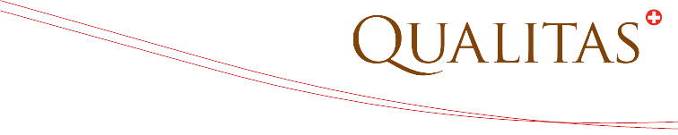
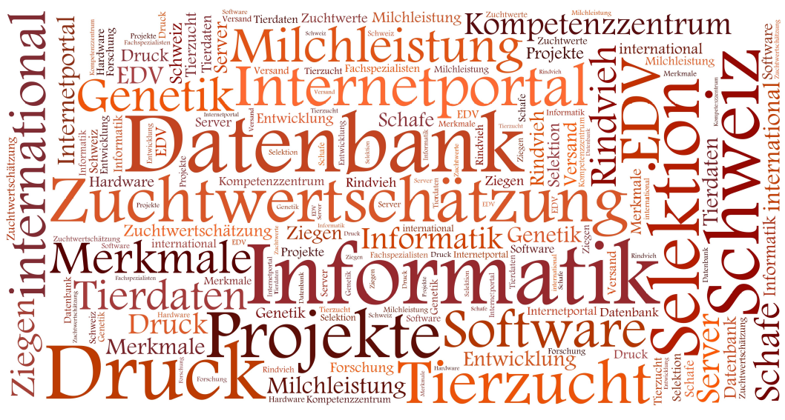

---
output:
  pdf_document:
    fig_caption: no
    includes:
      in_header: tex/header.tex
  word_document: default
---

```{r DocumentSetup, echo=FALSE, results='hide', include=FALSE}
### # specify knitr options
knitr::opts_chunk$set(echo = FALSE, results = 'asis')
```

```{r ChunkHooks, results='hide'}
### # specify hook function
knitr::knit_hooks$set(conv.odg = rmddochelper::odg.graphics.conv.hook)
```

```{r SectionEnumeratorSetup, results='hide'}
### # initialize section counter
robjSecEnum <- rqudocuhelper::SectionEnumerator$new()
```

```{r AbrTableSetup, results='hide'}
### # init table of abbreviation
r6ob_abbrtable <- rmddochelper::R6ClassTableAbbrev$new()
r6ob_abbrtable$setColHeader(pvColHeader = c("Abkürzung","Bedeutung"))
#r6ob_abbrtable$setQuote(pbQuote = FALSE)
```

```{r DocuStatusTableSetup, results='hide'}
r6objDocStat <- rmddochelper::R6ClassDocuStatus$new()
r6objDocStat$setStatusColnames(psStatusColnames = c("Version", "Datum", "Wer","Status", "Projekt"))
```

```{r FigQualitasLogo, fig.align='right', out.width="\\textwidth"}

```

\fcolorbox{white}{white}{
	\parbox[t]{1.0\linewidth}{
		\centering \fontsize{12pt}{20pt}\selectfont % 
		\vspace*{0.1cm} % 

		\hfill Entwurf

		\vspace*{0.1cm} 
	}
}

\vspace*{0.25cm}

\fcolorbox{red}{white}{
	\parbox[t]{1.0\linewidth}{
		\centering \fontsize{25pt}{40pt}\selectfont %

		\vspace*{1.5cm}
    Schnittstelle zwischen TPS und ASR-DB

		\vspace*{1.5cm} % Space between the end of the title and the bottom of the grey box
	}
}

\vspace*{1cm}


```{r FigWordCloud, fig.align='center', out.width="\\textwidth"}

```


\vspace{5ex}
{\centering \small
\hfill
\begin{tabular}{l}
Peter von Rohr                      \\
FB EDV, Qualitas AG                 \\
Chamerstrasse 56, CH-6300 Zug       \\
\verb+http://www.qualitasag.ch+     \\
\verb+peter.vonrohr@qualitasag.ch+  
\end{tabular}
}

\pagebreak

\tableofcontents

\pagebreak


```{r DocuStatusTable}
r6objDocStat$set_current_status(psVersion = "0.0.901",
                                psStatus = "Erstellung",  
                                psProject = "VnTps")
r6objDocStat$set_current_status(psVersion = "0.0.902",
                                psStatus = "Ausgangslage",  
                                psProject = "VnTps")
r6objDocStat$set_current_status(psVersion = "0.0.903",
                                psStatus = "Schnittstelle und Bestandteile",  
                                psProject = "VnTps")
r6objDocStat$include_doc_stat(psTitle = "# Dokumentenstatus")
```


\pagebreak


# Erklärung
```{r AbbrevNotMentioned, echo=FALSE, results='hide'}
r6ob_abbrtable$add_abbrev(psAbbrev  = "ASR", 
                          psMeaning = "Arbeitsgemeinschaft Schweizer Rinderzüchter", 
                          pbOut     = FALSE )
r6ob_abbrtable$add_abbrev(psAbbrev  = "ZO", 
                          psMeaning = "Zuchtorganisation", 
                          pbOut     = FALSE )
```
Dieses Dokument ist ein Entwurf einer Beschreibung der Datenschnittstelle zwischen `r r6ob_abbrtable$add_abbrev(psAbbrev = "TPS", psMeaning = "Tierarzt Praxissoftware")` und der `r r6ob_abbrtable$add_abbrev(psAbbrev = "ASR-DB", psMeaning = "Datenbank der bei ASR angeschlossenen ZO")`.


# Ausgangslage
Bestehende Datenquellen, welche Gesundheitsdaten von Milchvieh enthalten sollen miteinander vernetzt werden. Im  Kontext dieses Projekts definieren wir den Term `Gesundheitsdaten` als Oberbegriff für Diagnosen, Behandlungen und Medikamente. Die Vernetzung der Datenquellen mit Gesundheitsdaten hat das Ziel die Daten zwischen den Quellen auszutauschen. Als ein Beispiel von verschiedenen Datenquellen mit Gesundheitsdaten können wir die verschiedenen Instanzen der TPS bei den Tierärzten und die ASR-DB betrachten. Die folgende Darstellung gibt eine Übersicht über den geplanten Datentransfer zwischen TPS und ASR-DB. Die in blauer Farbe gezeichneten Pfeile stellen schon existierende Datenverbindungen dar. Der grüne Pfeil der Datenübermittlung zwischen TPS und Argus-DB kommt im Rahmen dieses Projekts neu hinzu.


```{r DataSource, conv.odg=TRUE, conv.odg=TRUE, odg.graph.cache=TRUE, fig.align='center', out.width="13cm", echo=FALSE, results='asis'}
knitr::include_graphics(path = "DataSource.pdf")
```

## Szenarium
Wir verwenden das folgende Szenarium für die Beschreibung der Vorgänge im oben gezeigten Diagramm. Der Tierarzt besucht einen bestimmten Betrieb für eine Konsultation und/oder für eine Bestandesbetreuung (siehe 1). Dabei können Gesundheitsdaten in Form von Diagnosen, Behandlungen und Medikationen anfallen. Diese werden vom Tierarzt erfasst und ins TPS eingetragen (siehe 2). Diese Vorgänge und Datenströme existieren bereits und werden durch dieses Projekt nicht beeinflusst werden.

Neu in diesem Projekt ist die Datenübertragung vom einzelnen TPS zur ASR-DB (siehe 3). In diesem Vorgang sollen periodisch die Gesundheitsdaten für das Milchvieh von den TPS zur ASR-DB übertragen werden. Die für diese Übertragung benötigten Schnittstellen werden in diesem Dokument beschrieben.


# Beschreibung der geplanten Schnittstellen
## Terminologie
Technisch gesehen, entspricht eine __Schnittstelle__ eines Softwaresystems den Signaturen und allenfalls den Dokumentationen aller öffentlicher Methoden^[Eigentlich sollte man hier von __Routinen__ der Gesamtheit aus Funktionen und Prozeduren sprechen]. Methoden sind dann öffentlich, sobald diese einem potentiellen Benutzer des Systems zur Verfügung gestellt werden. 

Mit __Signaturen__ bezeichnen wir die Deklarationen der Methoden. Diese Deklarationen bestehen aus den Methodennamen, den Methodenargumenten samt Datentypen und aus den Datentypen, welche als Resultate zurückgegeben werden. Die Schnittstellen an sich beinhalten noch keine Umsetzung, d.h. noch keinen Programmcode. 

Sobald eine Schnittstelle in einem Programm umgesetzt wird, spricht man von der __Implementation__ der Schnittstelle. 


## Bestandteile einer Schnittstelle
Aufgrund der Definition einer Schnittstelle als die Menge der Signaturen aller öffentlicher Methoden sind die notwendig vorhandenen Bestandteile gegeben. Somit hat jede Schnittstellendefinition eine hierarchische Struktur. Diese Hierarchie besteht aus den folgenden Teilen.

- Liste der öffentlichen Methoden
- Für jede Methode $m$ wird die Signatur $S_m$ bestimmt
- Jede Signatur besteht aus Methodennamen, Methodenargumenten samt Datentypen und aus dem Resultattyp.
- Datentypen müssen definiert werden. 

Die Bestandteile einer Schnittstelle können wie folgt graphisch dargestellt werden.

```{r ApiComp, conv.odg=TRUE, conv.odg=TRUE, odg.graph.cache=TRUE, fig.align='center', out.width="11cm", echo=FALSE, results='asis'}
knitr::include_graphics(path = "ApiComp.pdf")
```


## Vorteile einer Schnittstelle
Schnittstellen erzeugen Unabhängigkeiten zwischen Systemen, welche Daten untereinander austauschen. Für unser Szenarium heisst das, dass wir über eine Schnittstelle für den Datenaustausch die Unabhängigkeit der TPS von der ASR-DB gewährleisten. Weshalb das wichtig ist wollen wir hier kurz analysieren. 

Grundsätzlich wäre es möglich Daten ohne Schnittstellen zwischen TPS und ASR-DB auszutauschen. In beiden System TPS und ASR-DB werden die Daten in einer Datenbank oder einer ähnlichen Struktur gehalten. Wenn die beiden Partner TPS und ASR-DB das Design^[Verteilung der Informationen auf Datenbanktabellen] beider Datenbanken kennen, könnten die Daten auch direkt von der jeweiligen Partner-Datenbank abgefragt werden. Ein Datenaustausch über direkte Datenbankabfragen schafft eine direkte Abhängigkeit des Datenaustauschs vom Design der beiden Partner-Datenbanken. Durch diese Abhängigkeit muss bei jeder Anpassung des Datenbankdesigns bei beiden Partnern auch die Abfragen für den Datenaustausch angepasst werden. Dies würde zu einer erhöhten Fehleranfälligkeit und zu einer extremen Zunahme des Aufwandes für das Management eines solchen Datenaustauschs führen. Dieses Problem ist eindeutig durch die Abhängigkeit zwischen dem Datenaustausch und dem Design der Datenbanken verursacht.

Eine Schnittstelle kann diese Abhängigkeit durchbrechen. Durch die Definition einer Schnittstelle wird das Design der Datenbank vom Datenaustausch entkoppelt. Bei einer Änderung des Datenbankdesigns muss jeder Partner des Datenaustauschs bei sich lokal sicherstellen, dass die Definition der Schnittstelle erfüllt ist.


## Schnittstellen für den Datenaustausch


# Abgrenzung
Mit der Umsetzung dieses Projekts wird ein weiterer Datenstrohm eröffnet, auf welchem Gesundheitsdaten in das System der ASR-DB importiert werden. Davon abgesehen können Züchter aktuell selber über die graphischen Oberflächen redonline+ und BrunaNet Gesundheitsdaten von ihren Zuchttieren erfassen. Ob und falls ja wie allfällige Datenredundanzen zusammengeführt und bereinigt werden, ist nicht Thema dieser Beschreibung.

Dieses Dokument ist eine reine Schnittstellenbeschreibung. Somit enthält es keine konkreten Angaben zu einer Umsetzung in einem Softwareprogramm.


<!-- ------------------------------------------------------------------------------------ --
  -- END of document:  Below this must not be anything, except the table of abbreviations --
  -- ------------------------------------------------------------------------------------ --> 

\pagebreak

```{r WriteTableOfAbbreviations, results='hide'}
if (!r6ob_abbrtable$is_empty_abbr())
  r6ob_abbrtable$writeToTsvFile()
```

```{r AbrTableToDocument}
r6ob_abbrtable$include_abbr_table(psAbbrTitle = "# Abkürzungen")
```


